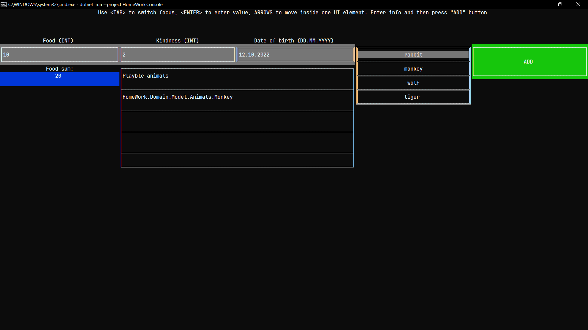

# Home Work 1, Designing Software course

## Idea
I've used Clean Architecture and DDD approaches for designing this project. \
In short, this project performs inventory of the zoo. \
Domain model describes bussiness rules, so I guess you are better off finding out them from there. \
(The code is more verbose than words about the code).

## Run:
```
dotnet run --project HomeWork.Console
```
I've used my [Sunnyyssh.ConsoleUI](https://github.com/sunnyyssh/CONSOLEUI) library btw. \
Please make terminal window as big as possible because some absolute sizes may not suit the terminal. \
Also make sure that you press `<ENTER>` after entering a value. \
(asking: Do not pay much attention on UI configuration cringe that I've done) \
It runs like that: 



## SOLID
**One** example for every **SOLID** letter:
- **S**ingle Responsibility - All my classes have high cohesion of their functionality. For example: All [`ICheckUp<TAnimal>`](HomeWork.Domain\Model\ICheckUp.cs) implementations have the only functionality of one exact animal check-up.
- **O**pen/Close - Every functionality is open to scale by adding additional implementation and close to change existing ones. For example: I've used an abstraction [`IDateOfBirthValidator`](HomeWork.Domain\Model\Validators\IDateOfBirthValidator.cs) to make possible change its implementation in the future. 
- **L**iskov substitution - Every inheritor in the project have exact same functionality as its base class except differences in context. For example: Every animal implement [`Food`](HomeWork.Domain\Model\Animal.cs) property in the way it was supposed because every inheritor implement it with the meaning of food needed to eat every day.
- **I**nterface segregation - All interfaces (I mean not C# language interfaces but the contract that module introduce) are really slim having one or two methods with high cohesion. Take any class and see.
- **D**ependency invertion - Every functionality module depend on abstraction of another module, instead of using exact implementation. This gives an opportunity to have no direct dependencies between modules and this helps testing and scaling.

# Tests
I'll just pray it'll work
